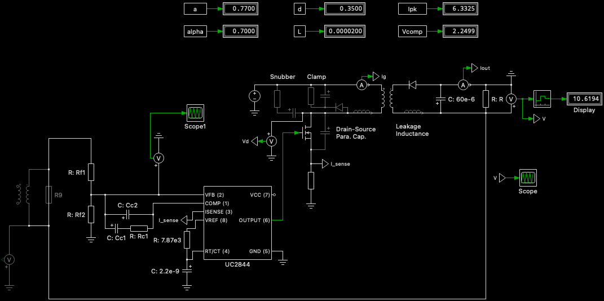
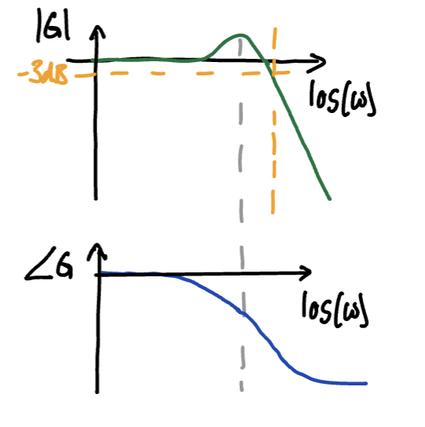
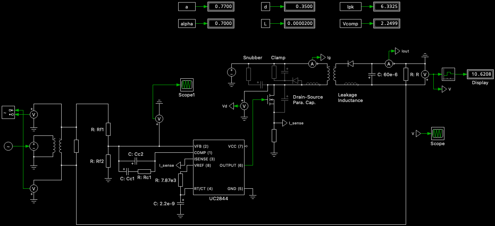

## Carter Harris

---

## Pre-Lab Writeup

### Calculating System Parameters

The first step in designing a closed-loop control system for the flyback converter is to determine the relevant loop shaping system parameters.

#### Gain Crossover Frequency & Phase Margin

The first step is determining the correct gain crossover frequency. In general, per the Loop Shaping Recipie, this frequency should be well below the switching frequency and the zeros that cause a delay.

Calculating the desired gain crossover frequency begins with the bandwidth specified in the design requirements, which is 1/8 of the switching frequency. Given our 50kHz switching frequency, and converted to radians, this frequency equals $50e3\cdot 0.125 \cdot 2\pi = 39270 rad/s$.

Given that the design requirements also specify a damping coefficient $\zeta = 0.6$, per the Loop Shaping notes, the bandwidth is roughly equal to the natural frequency, $\omega_o$. From the natural frequency, the gain cross-over frequency $\omega$ can then be calculated such that $$ \omega = \omega_o \sqrt{-2\zeta^2 + \sqrt{4\zeta^4 + 1}} $$ Subsituting in our known values for the bandwidth (equal to the natural frequency as discussed) for $\omega_o$ and $0.6$ for $\zeta$ results in a cross-over frequency of $ \omega = 39270\sqrt{-2\cdot 0.6^2 + \sqrt{4\cdot 0.6^4 + 1}} = 28105 rad/s$.

Moving to the phase margin, this quantity is directly related to the damping ratio. Our desired damping ratio of $\zeta = 0.5$ corresponds to a phase margin of 60 degrees. As such, 60 degrees will be used as the phase margin.

#### Determining Actual Gain & Phase Margin

Next, to determine the "starting point" of the converter's response, we need to know the current gain and phase margin at our gain crossover frequency calculated above, $\omega_{gc}$. Our calculated $\omega_{gc}$ in radians corresponds to a frequency of 4473Hz. The current response can be extracted from the real-world response measued to create the Bode plot at a 10V output in Lab 9. Looking at this bode plot for a frequency of 4473 Hz, we see that the absolute value of the current gain is equal to $|G_p(\omega = \omega_{gc})| = 12.5dB$. Further, the phase angle equals $\angle G_p(\omega = \omega_{gc}) = -76^\circ$.

From the current gain, the gain $K_p$ is defined such that it is the inverse of our measured gain, i.e. $K_p = -12.5dB$. However, converting this quantitiy from units of dB to unity gain, $K_p = 10^{\frac{-14}{20}} = 0.24$.

#### Calculating The K-Factor

The K-factor quantifies the phase boost needed to reach the desired phase margin of $60^\circ$ given the measured phase shift and the intergrator's $90^\circ$ phase shift. This quantify is defined in terms of the necessary phase boost, $\phi_{boost}$, defined as $$\phi_{boost} = PM - (180^\circ + (\angle G_p(\omega = \omega_{gc}) - 90^\circ))$$
where $PM$ is the desired phase margin. Substituting in our desired and measured values results in a necesssary boost of $\phi_{boost} = 60 - (180^\circ + (-76^\circ - 90^\circ)) = 46^\circ$ boost. The K-Factor is defined in terms of the necessary phase boost such that $$K = \tan{\frac{\phi_{boost}}{2} + 45^\circ}$$
Substituting in our known and measured values here results in $K = \tan{\frac{46}{2} + 45} = 2.48$.

**NOTE:** When doing the original calculations, I had originally calculated the crossover gain incorrectly, which resulted in pulling an incorrect initial phase angle from the Lab 9 Bode plot. While I recalculated everything else, I forgot to recompute the K-Factor, which I had incorrectly caculated as 3.49. As such, since the K factor is used to calculated DC gain and every other component is determined based upon this gain, this error traveled down quite far in the component selection. Due to the short turnaround, I didn't have time to rebuild and remeasure the circuit. The pre-lab will contian all accurate calculation, and the noted differences in components used will be detailed in the lab execution section.

#### Calculating DC Gain
Next, the K-factor and $K_p$ are used to caclulate the DC gain of the loop. Based upon these quantities and the cross-over frequency, the DC gain is defined such that $$ G_{co} = K_p \cdot \omega_{gc} \cdot \sqrt{\frac{1 + K^{-2}}{1 + K^2}}$$ Substituting in the previously-calculated values results in a target DC gain of $G_{co} = 0.24 \cdot 28105 \cdot \sqrt{\frac{1 + 2.48^{-2}}{1 + 2.48^2}} = 2719$.

### Determining Component Values
Once the DC gain is known, all component values can subsequently be calculated based upon it.

First, however, is choosing $R_{f1}$, the upper resistor of the voltage divider bringing the output voltage from 10V to 2.5V. This resistor is generally a few kilohms. As such, based upon the components avalible, I chose to use a $3.9k\Omega$ resistor. Given this resistor and the known input and output voltage, the second resistor in this divider, $R_{f2}$, should be about $1.3k\Omega$. The closest avalible resistor is $1.2k\Omega$, which was chosen.

Next, $C_{c1}$ is chosen to achieve the desired DC gain such that $$ G_{co} = \frac{1}{R_{f1} \cdot C_{c1}}$$
Rearragned to solve for $C_{c1}$, this equation equals $C_{c1} = \frac{1}{G_{co} \cdot R_{f1}}$, and substituting in known values results in $C_{c1} = \frac{1}{3900 \cdot 2719} = 0.09\mu F$. The closest nominal component is $0.1\mu F$, which was used for $C_{c1}$.

Next, $C_{c2}$ is chosen to achieve the desired K-factor (phase). This relation is defined such that $$ K = \sqrt{\frac{C_{c1}}{C_{c2}}}$$
Rearranged for $C_{c2}$, this equation equals $C_{c2} = \frac{C_{c1}}{K^2}$. Substituting prior values results in $C_{c2} = \frac{0.1e\text{-}6}{1.92^2} = 27nF$. The closest nominal provided resistor is $22nF$, which was used.

Next, $R_{c1}$ is found based on the relationship that $\omega_c = \omega_{gc}$. $R_{c1}$ is defined such that $$\omega_c = \frac{1}{R_{c1} \sqrt{C_{c1} \cdot C_{c2}}}$$
Rearranged to solve for $R_{c1}$, this equation equals $R_{c1} = \frac{1}{\omega_c \sqrt{C_{c1} \cdot C_{c2}}}$. Solving using the prior component values results in a $R_{c1} = \frac{1}{20115 \cdot \sqrt{0.1e\text{-}6 \cdot 22e\text{-}9}} = 1060 \Omega$. The closest provided nominal resistor is $1k\Omega$, which was chosen.

The resulting compoent selection is:
- $R_{f1} = 3.9k\Omega$
- $R_{f2} = 1.2k\Omega$
- $C_{c1} = 0.1\mu F$
- $C_{c2} = 22nF$
- $R_{c1} = 1k\Omega$

These components were simulated in PLECS with the following circuit:



The predicted output voltage is 10.62 volts.

---


## Lab Execution

As stated above, an error in the K-factor calculation resulted in some error in the component selection. The utilized $R_{f1}$ and $R_{f2}$ were the same, but the other compoents were slighly different in value, although remained on the correct order of magnitude. The values used were:
- $C_{c1} = 0.22\mu F$
- $C_{c2} = 15nF$
- $R_{c1} = 820\Omega$.

All hardware was installed according to the Lab 10 worksheet instructions, and upon turning the converter on, it worked with an output of 10.70V. This voltage is slightly higher than the provided tolerance of 10V +/- 0.5V. However, given the limited time to troubleshoot, this was given the ok by the teaching team.

#### Q1: Take and save a baseline $V_{sh}$/$V_{drain}$ measurement

```{python}
from rigol import read_rigol_csv
from matplotlib import pyplot as plt
import pandas as pd

# Plot Entire Waveform
[bl_wv_data, _, _] = read_rigol_csv("data/base.csv")

fig, ax1 = plt.subplots()

ax1.plot(bl_wv_data["X"], bl_wv_data["CH1"], label="Vsh")
ax1.set_xlabel("Time (s)")
ax1.set_ylabel("Shunt Voltage (V)")

#plt.xlim(3e-5, 6.3e-5)
ax2 = ax1.twinx()
ax2.plot(bl_wv_data["X"], bl_wv_data["CH2"], label="Vdrain", color='tab:orange')
ax2.set_ylabel("Drain Voltage (V)")

plt.title("Baseline Flyback Voltage over Time")
lines = ax1.get_lines() + ax2.get_lines()
ax1.legend(lines, [line.get_label() for line in lines], loc='upper center')
```

### Open-Loop Transfer Function Measurement

Next, an Analog Discovery and a measurement transformer were used to measure the open-loop frequency response of the control system. The resulting Bode plot is shown below.

#### Q2: Plot the $G_{OL}$ Bode plot

```{python}
ol_bode = pd.read_csv("data/open_network_analysis.csv")

plt.figure(figsize=(6, 6))
plt.subplot(2, 1, 1)
plt.semilogx(ol_bode["Frequency (Hz)"], ol_bode["Channel 2 Magnitude (dB)"])
plt.semilogx(ol_bode["Frequency (Hz)"], 0*ol_bode["Frequency (Hz)"], linestyle="dashed")
plt.xlabel("Frequency (Hz)")
plt.ylabel("Magnitude (dB)")
plt.subplot(2, 1, 2)
plt.semilogx(ol_bode["Frequency (Hz)"], ol_bode["Channel 2 Phase (deg)"])
plt.semilogx(ol_bode["Frequency (Hz)"], ((0*ol_bode["Channel 2 Phase (deg)"])-180), linestyle="dashed")
plt.xlabel("Frequency (Hz)")
plt.ylabel("Phase (deg)")
plt.suptitle("Flyback Control Open-Loop Response")
plt.tight_layout()
```

#### Q3: Determine the cross-over frequency, phase margin, and gain margin. Are the requirements met?
- A line in plotted at zero which shows where the gain cross-over occurs. By inspection of the data, the cross-over frequency is approximently 3700Hz. This is an error of about 500 Hz above the designed-for 3200 Hz (20115 rad/s) which is relativly close to the design requrirement.
- The phase angle at the gain cross-over frequency is about $95^\circ$ which means the system has a phase margin (180 - phase angle at gain cross-over frequency) of about $85^\circ$. This angle is quite a bit larger than the $60^\circ$ that was designed for. However, due to the error mentioned in the pre-lab K-factor calculations, this system was actually designed to have a phase margin of $88^\circ$. In terms of those calculations, this system is behaving exactly as expected. However, in terms of the actual requirements, it is not. The much higher phase margin means that the system has a significantly higher damping coefficent $\zeta$ and is thus quite overdamped - as evidenced by the larger-magnitude phase angle towards the end of the plot.
- The gain margin is the magnitude of the gain at the phase crossover frequency, which is the first point that the phase crosses $180^\circ$. This phase crossover occurs at about 17027 Hz, at which point the gain of the system is -13.4dB. The gain crossover is the opposite of this value, meaning the gain crossover equals 13.4dB.

#### Q4: What does the low frequency magnitude and phase-shift correspond to?
- The high low frequency magnitude and $-90^\circ$ phase shift are both caused by the integrator in the feedback circuit which adds a pole at zero.

#### Q5: What can you predict in terms of stability and performance of the closed-loop control?
On account of the fairly high gain margin, this system is extremly stable. While the overdamped nature of this system helps in that stability, it does reduce the performance of the system. Because of the high overdamping (as evidenced by the LARGE phase shift), the system takes a long team to reach a steady-state output, as will be further explored in the step response measurement below. While this overdamped behavior could be useful in certain scenarios where the output voltage can not pass the designed output (for fear of damaging downstream components, for example), it really only decreases performance in our case.

### Closed-Loop Transfer Function Measurement

#### Q6: Plot the G(s) Bode Plot

```{python}
cl_bode = pd.read_csv("data/closed_network_analysis.csv")

plt.figure(figsize=(6, 6))
plt.subplot(2, 1, 1)
plt.semilogx(cl_bode["Frequency (Hz)"], cl_bode["Channel 2 Magnitude (dB)"])
#plt.semilogx(cl_bode["Frequency (Hz)"], 0*cl_bode["Frequency (Hz)"], linestyle="dashed")
plt.xlabel("Frequency (Hz)")
plt.ylabel("Magnitude (dB)")
plt.subplot(2, 1, 2)
plt.semilogx(cl_bode["Frequency (Hz)"], cl_bode["Channel 2 Phase (deg)"])
#plt.semilogx(cl_bode["Frequency (Hz)"], ((0*cl_bode["Channel 2 Phase (deg)"])-180), linestyle="dashed")
plt.xlabel("Frequency (Hz)")
plt.ylabel("Phase (deg)")
plt.suptitle("Flyback Control Closed-Loop Response")
plt.tight_layout()
```

#### Q7: Does the transfer function reasonably resemble a second order system?

Overall, yes, this system does reasonably resemble a second order system. As previously described, the overdamped nature of our system in particular does result in the graph looking slightly different than the realizable closed-loop response that we indeed to design our system based upon:



While the same "bump" is not present in our bode plot, this is due to the time-domain overshoot not occuring as a result of our overdamped system. The slow response that is seen is still evidence of overdamped oscillations that define a second-order system.

#### Q8: What is the cut-off frequency and bandwidth of the closed-loop control?

The cut-off frequency is generally defined as the point where the frequency drops below -3dB. According to our above Bode plot, this point occurs at roughly 5300Hz. If we assume that the bandwidth is the area up until the cut-off frequency is reached, given the fairly stable bandwidth up until that point, the bandwidth is also 5300Hz. This bandwidth is slightly lower than our design bandwidth based upon 1/8 of the switching frequency which was 6250Hz.


#### Q9: What does the Bode plot suggest about the damping ratio of the closed-loop system? Estimate the damping ratio from the shape of the transfer function.

It is quite evident from the phase response of the closed-loop system that the system is quite overdamped. At the cross-over frequency, the phase is only about $-90^\circ$, where it should be approaching much closer to $-180^\circ$ (ie, the slope would be more gradual and start earlier) to be correctly underdamped, as shown in the difference between the yellow and red responses in the theoretical plot above.
Given that we know the system is overdamped, zeta is greater than 1. Based on best estimation, the damping ratio is likely somewhere around $\zeta = 1.5$.

#### Q10: Does the damping ratio fit with the measured phase margin?

As previously stated, the phase at the gain cross-over frequency is nearly $-90^\circ$, meaning there is still a phase margin of almost $90^\circ$. This phase margin is quite high and means there is a lot of room for the phase margin to increase (ie further delay) before the system approaches instability by surpassing $-180^\circ$ at the gain crossover frequency. This fits with the damping ratio - an overdamped system, althogh it has a slow response, is extremly stable. This large phase margin reflects that stability. While this large phase margin is largly unnecessary for use cases, this stability could be good if a large delay was expected on the closed-loop signal reaching the controller.

### Step Response Analysis

#### Q11: Plot the step response measurements
Note: There is 50kHz switching noise from the normal flyback operating that becomes quite apparent in the output voltage. A pretty steep rolling mean is applied in order to remove this noise and inspect the waveform. However, the analysis should still be accurate since we are really only considered with the mean response of the waveform.

Each meaurement is plotted on independent axis to analyze their response side-by-side.

```{python}
step_data = pd.read_csv("data/step_response.csv")

step_data["Channel 2 (V)"] = step_data["Channel 2 (V)"].rolling(100).mean()

V_offset = 10.65

fig, ax1 = plt.subplots()

ax1.plot(step_data["Time (s)"], step_data["Channel 1 (V)"], label="Input Perturbation")
ax1.set_xlabel("Time (s)")
ax1.set_ylabel("Input Perturbation (V)")

ax2 = ax1.twinx()
ax2.plot(step_data["Time (s)"], step_data["Channel 2 (V)"], label="Ouput Voltage", color='tab:orange')
ax2.set_ylabel("Output Voltage (V)")

plt.title("Step Response over Time")
lines = ax1.get_lines() + ax2.get_lines()
ax1.legend(lines, [line.get_label() for line in lines], bbox_to_anchor=(1.1, 1.05))
```

#### Q12: Estimate the step response overshoot.

Given our system is quite overdamped instead of underdamped, there is no overshoot of the target voltage. Instead, we can observe the slow, overdamped response where the waveform appears to be just barely approach a point of stability before the perturbation ends. Although it's hard to make out from the 50kHz switching noise, it is additionally possible that steady state isn't yet reached when the perturbation is switched off, further highlighting that the system is too overdamped.

This behavior suggests that even if a highly-stable, overdamped response was desired, the zeta value should still be smaller than it is in this controller implementation.

#### Q13: Estimate the damping ratio from the amount of overshoot and determine the damping ratio.

Given that our system did not overshoot, it's not quite possible to estimate the damping ratio in the same manner. Rather, I returned to the earlier-calculated bandwidth and cut-off frequency to attempt to estimate the damping ratio.

In doing some research (and finding this [StackOverflow post in particular](https://electronics.stackexchange.com/questions/565679/finding-resonant-frequency-or-damping-ratio-from-bode-plot)), I found the the relationship defining the bandwidth in terms of the natural frequency: $$ \omega_{co} = \omega_n \sqrt{1 - 2\zeta^2 + \sqrt{2 - 4\zeta^2 + 4\zeta^4}} $$
or, solved for $ \zeta $, $$ \zeta = \frac{\sqrt{-\omega_{co}^2 + 2\omega_{co}^2\omega_{n}^2 + \omega_n^4}}{2\omega_{co}\omega_{n}} $$
Based upon the above-linked StackOverflow resource, the natural frequency (which we can't approximate to the bandwidth given the damping rato is not in the 0.6-0.7 range) is estimated as the frequency where the phase angle equals -90, in our case, 7400Hz. Plugging in this value alongside the 5300Hz cut-off frequency results in a zeta estimate of $\zeta = 0.93$.

By inspection of the data, I don't feel that this damping ratio really makes much sense - the system is clearly much more overdamped. However, given the avalible performance data, I'm not quite sure of a better way to estimate the damping ratio (and neither were the CAs), besides retaking data with corrected components that we unfortunetly didn't have time for.

### Final Observations

#### Q14: Do the three types of measurement tell us the same story about the performance of the controller? Elaborate.

Overall, all three types of measurements tell us a similar story about the performance of our controller. All plots allude to the sucessful implementation of a second-order system for controlling the output voltage. Further, each does tell the same story about the unintended highly overdamped behavior of the system. While each highlights different aspects of the system (the open loop higlighting the high DC gain, the closed loop the cut-off frequency, and the perturbation the time-domain response and slow apprach to steady state), each allude to the same second-order, damped, oscillatory system. While the overdamping is unintended, all show a system that reaches the desired 10V output (alebit just barely in the step time) with generally the correct-shaped waveforms.

#### Q15: Could your controller design be improved? In what regards?

Overall, our system could definietly be improved to better reach the target damping ratio that we were designing for. An overdamped design is certaintly desirable for some use cases, such as operating with sensitive components or if you had to increasing your operating voltage such that you were pushing their rated voltage limits. However, for our use case where this small voltage spike would not negativly impact ther circuit, the slow response of this overdamped system outweights the benifits. As such, the system could be improved with better-selected components to get a damping raito closer to 0.6.

I attempted to test the updated pre-lab calculation in PLECS using the small-signal analysis shown in the pre-lab instructions. Interestingly, the sign of the resulting magnitude and phase shift where opposite from that of the real-world lab hardware. I'm not sure what to make of this, but if the sign is flipped, the waveform looks quite similar to that of the lab hardware. As such, I've flipped this measurement and plotted it against the original below.

The following PLECS simulation was used to analyze the perturbation:



```{python}
ol_bode = pd.read_csv("data/open_network_analysis.csv")
ol_plecs = pd.read_csv("data/plecs_open.csv")

plt.figure(figsize=(6, 6))
plt.subplot(2, 1, 1)
plt.semilogx(ol_bode["Frequency (Hz)"], ol_bode["Channel 2 Magnitude (dB)"], label="Lab Hardware")
plt.semilogx(ol_plecs["freq"], -ol_plecs["mag"], label="PLECS Model")
plt.semilogx(ol_bode["Frequency (Hz)"], 0*ol_bode["Frequency (Hz)"], linestyle="dashed")
plt.xlabel("Frequency (Hz)")
plt.ylabel("Magnitude (dB)")
plt.legend()
plt.subplot(2, 1, 2)
plt.semilogx(ol_bode["Frequency (Hz)"], ol_bode["Channel 2 Phase (deg)"], label="Lab Hardware")
plt.semilogx(ol_plecs["freq"], -ol_plecs["angle"], label="PLECS Model")
plt.semilogx(ol_bode["Frequency (Hz)"], ((0*ol_bode["Channel 2 Phase (deg)"])-180), linestyle="dashed")
plt.xlabel("Frequency (Hz)")
plt.ylabel("Phase (deg)")
plt.suptitle("Flyback Control Open-Loop Response")
plt.tight_layout()
plt.legend()
```

Overall, the "improved" component selection identified in the prelab performed better in some ways and slightly worse in others. Of note, the system has a lower gain crossover frequency of around 2400 Hz, which is below the designed-for 3400 Hz, and is swinging the other direction from the previously used compoennts that were 500 Hz above the target frequency. However, the phase margin is much smaller and much closer to the designed-for $60^\circ$ at $57^\circ$. This suggests that this implementation would have a damping constant much closer to the 0.6 that the system was designed for and represent a performance improvement over the real-world implementation used thus far.

## Independant Step

You asked for some brutually honest feedback of the class with this lab report, so here's a few of my opinions (alongside submitting the course eval):

Pluses
- This is without a doubt the best ECE class at Olin. To be fair, there's not many to choose from, but all around a great class.
- Olin constantly tries to find this line between "hand waving" plugging stuff into formulas and actually going through proofs and derivations, and rarely does it find a good balance. I thought this class found a pretty good balance.
- I liked the format of the lecture notes and the fill-in-the-blank in some areas.
- The magnetics lectures, with one small exception, made pretty good sense even though I've never taken an E&M class.
- Overall, pretty positive experience with the labs and simulations too. Not many notes here.

Deltas
- I wish we got a little bit more detailed or actionable feedback on the lab reports. I felt that sometimes I would get a comment that something was wrong or found indirectly, for example, and I wouldn't know how to fix it for the next lab. Sometimes the CAs could help, but oftentimes they couldn't provide a better method other than what they had written as a student. Possibly an answer key for them would help.
- I'm not exactly sure something needs to "change" persay, but moreso just a datapoint that I found this class VERY time intensive. It was by a longshot the class I spent the most amount of time on this semester, and it was often hard to balance my other classes and commitments and find enough time to get everything done to a level at which I wanted. This was especailly true with the project at the end and resulted in us starting much later than I would have wanted to since we were trying to stay above water on the labs. Everything did feel valuable, and I didn't often feel like my effort was futile like with some other classes, but still a time sink nonetheless.
- The very first magnetics lesson focused around flux/flux linkage - I'm not quite sure if it ever fully clicked for me. I was able to figure things out as we went along, but I wish I had absorbed more from this at the beginning. This is the one lesson that I think could probably use a little more beginner-friendly improvement.

