## Carter Harris
---
## Pre-Lab Bode Plots

Each bode plot, along with the identified poles and zeros, is included below. Note that on my paper prinout, it was quite hard to make out the tickmark lines, so some zeros/poles may be +/- 20 off.

#### Plot A

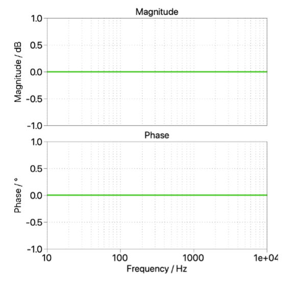

- **Poles:** As the frequency response is flat, there are no poles
- **Zeros:** Given above, there are also no zeros.
- **DC Gain:** The DC gain is 1.

#### Plot B

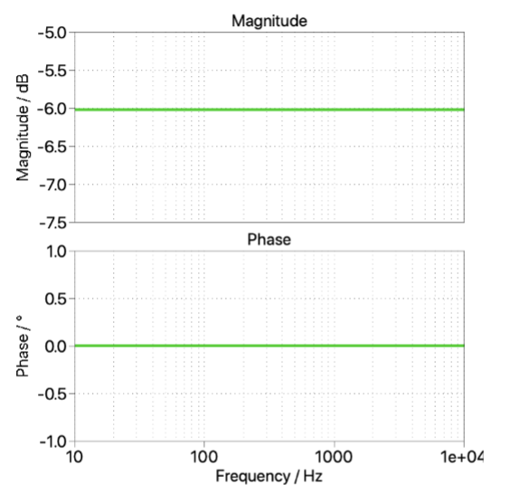

- **Poles:** As the frequency response is flat, there are no poles
- **Zeros:** Given above, there are also no zeros.
- **DC Gain:** The DC gain factor is 0.5 given a -6.0 dB gain.

#### Plot C

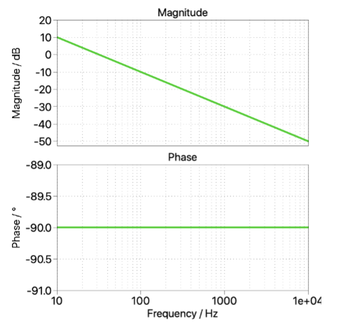


- **Poles:** There is a single pole at s = 0.
- **Zeros:** As the bode plot only has a negative slope, there are no zeros.
- **DC Gain:** Given the 20 dB per decade slope, the magnitude/dB at DC is 30 dB. As such, the DC gain is 31.6

#### Plot D

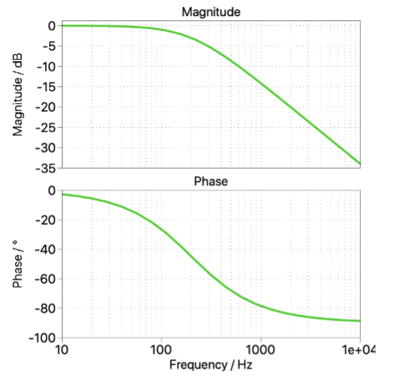


- **Poles:** There is a single pole at $s = \omega_o$, where $\omega_o = 110 Hz$.
- **Zeros:** There are no zeros.
- **DC Gain:** The DC gain is 1.

#### Plot E

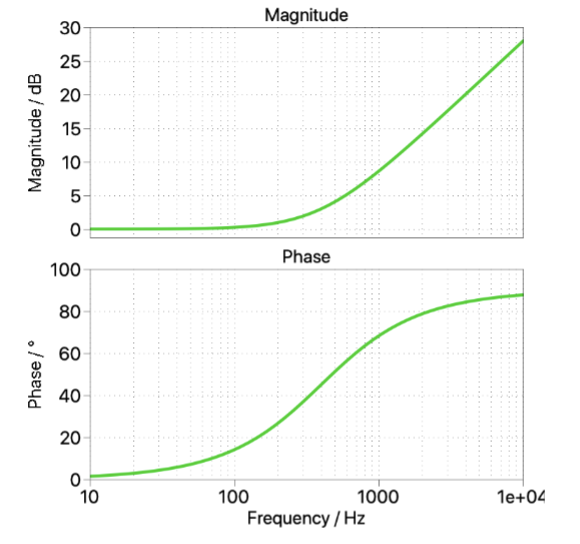


- **Poles:** There are no poles in this plot.
- **Zeros:** There is a single zero at $s = \omega_o$, where $\omega_o = 130 Hz$.
- **DC Gain:** The DC gain is 1.

#### Plot F

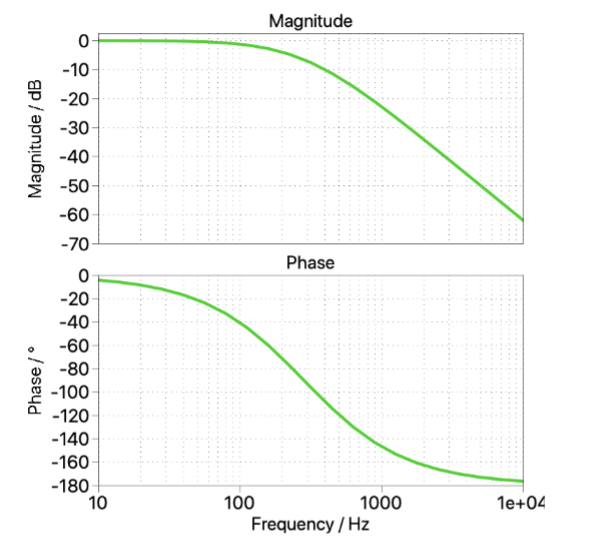


- **Poles:** There are two repeated poles at $s = \omega_o = 120 Hz$.
- **Zeros:** There are no zeros in this plot.
- **DC Gain:** The DC gain is 1.

#### Plot G

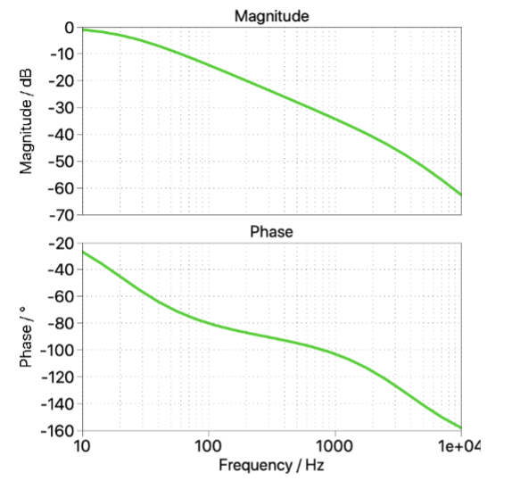


- **Poles:** There are two poles, one at $s = \omega_o = 10$ and another at $s = \omega_o = 3000 Hz$.
- **Zeros:** There are no zeros in this plot.
- **DC Gain:** The DC gain is 1.

#### Plot H

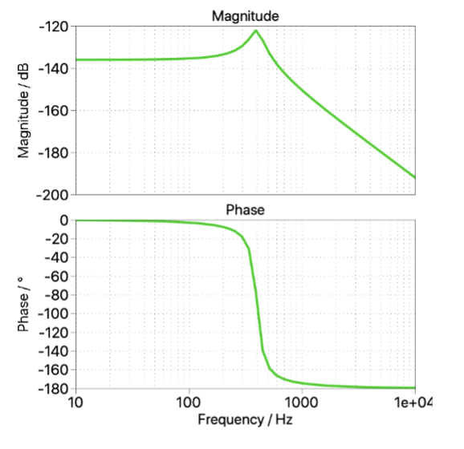


- **Poles:** There are two repeatedpoles at $s = \omega_o = 400 Hz$.
- **Zeros:** There is one zero at $s = \omega_o = 200 Hz$.
- **DC Gain:** The DC gain is about $3.16e\text{-}7$.

#### Plot I

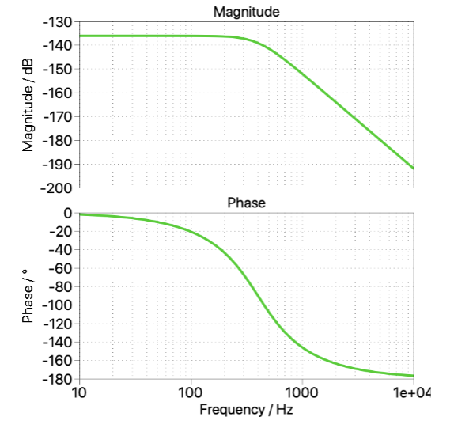


- **Poles:** There are two repeated poles at $s = \omega_o = 400 Hz$.
- **Zeros:** There are no zeros in this plot.
- **DC Gain:** The DC gain is $1.87e\text{-}7$.

#### Plot J

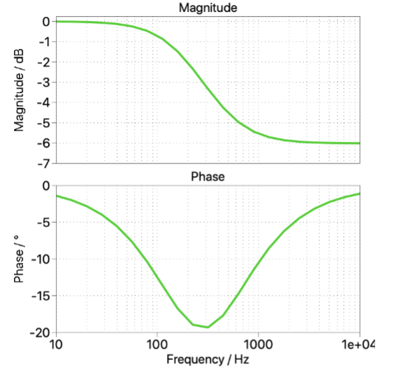


- **Poles:** There is one pole at $s = \omega_o = 100 Hz$.
- **Zeros:** There is one zero at $s = \omega_o = 400 Hz$.
- **DC Gain:** The DC gain is 1.

#### Plot K

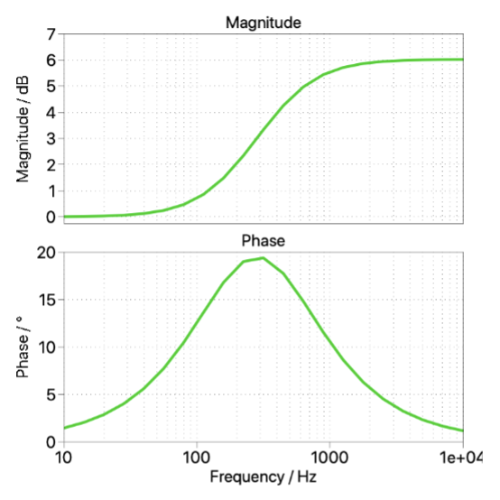


- **Poles:** There is one pole at $s = \omega_o = 900 Hz$.
- **Zeros:** There is one zero at $s = \omega_o = 90 Hz$.
- **DC Gain:** The DC gain is 1.

---


## Execution

### Part 1: DC Bias Measurement

Configure all settings as required for the Analog Discovery 2, set the offset to 1.5V, and increase the offset voltage in 0.1V increments until a 10V output is reached.

Each offset voltage and the associated output voltage and input current (as reported by the power supply) are noted below.
- 1.5V offset
    - 2.959V output, 0.17A input
- 1.6V offset
    - 3.85V output, 0.25A input
- 1.7V offset
    - 4.732V output, 0.35A input
- 1.8V offset
    - 5.617V output, 0.48A input
- 1.9V offset
    - 6.50V output, 0.62A input
- 2.0V offset
    - 7.42V output, 0.79A input
- 2.1V offset
    - 8.33V output, 0.98A input
- 2.2V offset
    - 9.24V output, 1.20A input
- 2.3V offset
    - 10.15V output, 1.43A input

#### Q1: At 10V, take a baseline $V_{sh}$ and $V_{drain}$ measurement.
Our 2.3V offset with a 10.15V output is shown below.

```{python}
from rigol import read_rigol_csv
from matplotlib import pyplot as plt
import pandas as pd

# Plot Entire Waveform
[bl_wv_data, _, _] = read_rigol_csv("data/off2_3.csv")

fig, ax1 = plt.subplots()

ax1.plot(bl_wv_data["X"], bl_wv_data["CH1"], label="Vsh")
ax1.set_xlabel("Time (s)")
ax1.set_ylabel("Shunt Voltage (V)")

#plt.xlim(3e-5, 6.3e-5)
ax2 = ax1.twinx()
ax2.plot(bl_wv_data["X"], bl_wv_data["CH2"], label="Vdrain", color='tab:orange')
ax2.set_ylabel("Drain Voltage (V)")

plt.title("Baseline Flyback Voltage over Time")
lines = ax1.get_lines() + ax2.get_lines()
ax1.legend(lines, [line.get_label() for line in lines], loc='upper center')
```

---

### Part 2: Small-Signal Transfer Function Analysis

Next, the analog disocvery is used to inject a small perturbation in the current control loop in order to generate a small-signal derived Bode plot describing the system transfer function at a 10V operating point (important note - this is only valid at that 10V operating point).

#### Q2: Why is the red output LED flickering during the sweep?
At the initial lower frequencies, the low-frequency perturbation causes the UC2844 to think the peak current has been reached much earlier than is actually truly reached. As such, the transistor is turned off earlier, all stored energy drains out of the transformer and smoothing capacitors, and the output voltage is actually momentarilly dropping to zero. Hence, as the red LED is in-line with the output, it turns off.

The offset voltages used to reach each desired output voltage are noted below:

- 5V output, 1.71V offset
- 7V output, 1.93V offset
- 10V output, 2.26V offset

In observing the drain and shunt voltages on the oscilliscope, slight jittering above/below starting point in the mangitude of each waveform was noted. The duty cycle also experienced this jittering action.

---

## Post-Lab Analysis

### Part 1: DC Bias Measurements

First, the various offset voltages and their associated ouputs, as noted in the execution section above, are graphed in a single plot below.

```{python}
offset_data = pd.read_csv("data/compiled_offset.csv")

plt.plot(offset_data["offset"], offset_data["output"], marker='x')
plt.xlabel("Offset Voltage (V)")
plt.ylabel("Ouptut Voltage (V)")
plt.title("Flyback Converter Offset Voltage Control")
```

Further analysis requires relating the offset voltage to a peak current.

From our study of the flyback converter, we know that the output voltage $V_o$ and the peak current $I_{pk}$ are related such that $I_{pk} = \sqrt{K} \cdot T_s \cdot \frac{V_o}{L}$. In this lab, are switching frequncy is 50 kHz, such that the period is $20 \mu S$, and K is defined such that $K = \frac{2}{T_s} \cdot \frac{L}{R}$. Given our previously-measured $19.95\mu H$ magnetizing inductance and $5 \Omega$ output resistance, $K = \frac{2}{20e\text{-}6} \cdot \frac{19.95e\text{-}6}{5} = 0.399$. Given these known values, our measured output voltage can be converted back into a peak current value.

```{python}
import math

K = 0.399
L = 19.95e-6
Ts = 20e-6

offset_data["Ipk"] = (offset_data["output"] / L) * Ts * math.sqrt(K)

plt.figure()
plt.plot(offset_data["offset"], offset_data["Ipk"])
plt.xlabel("Offset Voltage (V)")
plt.ylabel("Peak Current (A)")
plt.title("Flyback Calculated Offset-Controlled Peak Current")
```

However, this data can also be collected from our measured shunt voltage at each offset level. The resulting graph is shown below graphed along the same plot as our theroretical measurements.

```{python}
measured_peak_current = pd.DataFrame(data={'Voffset':[], 'Ipk':[]})

# Loop through all tested offset voltages - some trickery to get range() to gen floats
for offset_v in (x / 10 for x in range(15, 23)):
    # Read saved data with consistent file naming
    [offset_v_data, _, _] = read_rigol_csv(f"data/off{offset_v}.csv")   
    # Apply rolling mean in order to smooth out the transient peaks
    offset_v_data["CH1"] = offset_v_data["CH1"].rolling(10).mean()
    # Get peak shunt voltage
    peak_vsh = offset_v_data["CH1"].max()
    # Convert to current
    peak_current = peak_vsh / 0.05
    # Round to 4 decimal places to deal with float weirdness
    peak_current = round(peak_current, 4)
    # Some pandas trickery to append to the dataframe and correct indexing
    measured_peak_current.loc[-1] = [offset_v, peak_current]
    measured_peak_current.index = measured_peak_current.index + 1
    measured_peak_current = measured_peak_current.sort_index()
    

plt.figure()
plt.plot(
    measured_peak_current["Voffset"],
    measured_peak_current["Ipk"],
    color="tab:blue",
    label="Measured Relationship")
plt.plot(offset_data["offset"], offset_data["Ipk"], color='tab:orange', label="Theoretical Relationship")
plt.xlabel("Offset Voltage (V)")
plt.ylabel("Peak Current (A)")
plt.title("Theroretical & Measured Flyback Offset & Peak Current Relationship")
plt.legend(loc="upper left")
```

As expected, our real-world peak current is slightly higher than is estimated due to the real-world loss and inefficiencies of our transformer. As such, these real-world measured value will be used in all following calculations.

#### Q3: By inspecting the measurements, establish an expression for $I_{pk} = f(offset)$, where "offset" corresponds to the value that was set in the Wavegen "offset" field.

The above graph shows a clear linear relationship between the offset voltage and the output voltage. As such, a linear regression preformed on this data would provide define this equation.

```{python}
from scipy.stats import linregress

reg_output = linregress(measured_peak_current["Voffset"], measured_peak_current["Ipk"])

plt.figure()
plt.plot(
    measured_peak_current["Voffset"],
    measured_peak_current["Ipk"],
    color="tab:blue",
    label="Measured Relationship"
    )
plt.plot(offset_data["offset"], offset_data["Ipk"], color='tab:orange', label="Theoretical Relationship")
plt.plot(
    offset_data["offset"],
    ((offset_data["offset"] * reg_output[0]) + reg_output[1]),
    color = "tab:green",
    linestyle="dashed",
    label="Linear Fit"
    )
plt.xlabel("Offset Voltage (V)")
plt.ylabel("Peak Current (A)")
plt.title("Theroretical & Measured Flyback Offset & Peak Current Relationship")
plt.legend(loc="upper left")

print(f"Relationship: Ipk = V_offset * {reg_output[0]} {reg_output[1]}")
```


As shown above, the resulting relationship based upon the lab-measured data is $$ I_{pk} = 6.278V_{offset} - 7.328 $$

#### Study the schematic and identify how the offset voltage applied between JP5 and JP7 translates to a peak current value.

Given that jumper JP4 was switched to the 1-2 position, the voltage applied between JP7 and JP5 is fed first into a unity gain voltage follower before connecting directly (via the inserted JP6 jumper) into the $V_{comp}$ pin of the UC2844.

As measured experimentally for the same operating point in an ealier lab, the relationship between $V_{comp}$ and $I_{pk}$ is defined such that $Vcomp = \frac{3}{20}Ipk + \frac{13}{10}$. Rearranging this equation to solve for $I_{pk}$ results in $I_{pk} = \frac{20}{3}\cdot (V_{comp} - \frac{13}{10}) $.

#### Q4: Does your expression for $I_{pk} = f(offset)$ match what the circuit predicts?

In the below plot, the above equation is used to caculate the predicted $I_{pk}$ value with the same range of $V_{offset}$ values and is added to the same plot as shown prior.

```{python}
plt.figure()
plt.plot(
    measured_peak_current["Voffset"],
    measured_peak_current["Ipk"],
    color="tab:blue",
    label="Measured Relationship"
    )
plt.plot(offset_data["offset"], offset_data["Ipk"], color='tab:orange', label="Theoretical Relationship")
plt.plot(
    offset_data["offset"],
    ((offset_data["offset"] * reg_output[0]) + reg_output[1]),
    color = "tab:green",
    linestyle="dashed",
    label="Linear Fit"
    )
plt.plot(
    offset_data["offset"],
    ((20/3)*(offset_data["offset"] - (13/10))),
    color="tab:purple",
    label="Vcomp Theoretical"
    )
plt.xlabel("Offset Voltage (V)")
plt.ylabel("Peak Current (A)")
plt.title("Theroretical & Measured Flyback Offset & Peak Current Relationship")
plt.legend(loc="upper left")
```

As shown above, the theoretical peak current response is very similar to the actually measured current response. The slope of all methods of calculation are nearly identical (with the exception of the theoretical orange line from the Ipk calculated from the output voltage), with each varying slightly in the intercept. This V_comp theoretical intercept is likely lower given that it assumes perfect and ideal components,while our true current will be slightly higher due to the losses quantified in lab 8.

#### Q5: Document Observations

Most observations on each individual waveform and how they relate to each other are included above. Overall, the measured data and theroretical predicted data were very close, especially for the more directly measured $V_{comp}$ estimatation. While the $I_{pk}$ based on output estimation wasn't exact, it was the mostly indireclty measured of all the calculations.

---

#### By inspecting the measurements, establish an expression for V = f(offset), where V is the output voltage.

Returning to the first shown graph realting the offset voltage to the output voltage:

```{python}
plt.plot(offset_data["offset"], offset_data["output"], 'x')
plt.xlabel("Offset Voltage (V)")
plt.ylabel("Ouptut Voltage (V)")
plt.title("Flyback Converter Offset Voltage Control")
```

A linear regression can also be taken of this data to get a resulting equation.

```{python}
vout_reg_out = linregress(offset_data["offset"], offset_data["output"])

plt.figure()
plt.plot(offset_data["offset"], offset_data["output"], 'x', label="Measured Data")
plt.plot(
    offset_data["offset"],
    ((offset_data["offset"] * vout_reg_out[0]) + vout_reg_out[1]),
    label="Linear Fit",
    linestyle = 'dashed'
    )
plt.title("Linear Regression for Voffset to Vout")
plt.xlabel("Offset Voltage (V)")
plt.ylabel("Ouput Voltage (V)")
plt.legend(loc="upper left")

print(f"Relationship: Vout = V_offset * {vout_reg_out[0]} {vout_reg_out[1]}")
```

As shown above, the output voltage can be defined as a function of the offset voltage such that $$V_{out} = 8.99V_{offset} - 10.55 $$

Comparing to the predicted value involves taking a composite of the already stated theroretical and experimentally found equations defining $V_o$ in terms of the system parameters and $I_{pk}$ in terms of $V_{comp}$. Working backwards to find $V_{out}$ from $I_{pk}$ results in an equation such that $ V_o = 10.53V_{comp} - 13.69$. Both the measured data, resulting fit, and the theoretical equation are shown on one plot below.

```{python}
vout_reg_out = linregress(offset_data["offset"], offset_data["output"])

plt.figure()
plt.plot(offset_data["offset"], offset_data["output"], 'x', label="Measured Data")
plt.plot(
    offset_data["offset"],
    ((offset_data["offset"] * vout_reg_out[0]) + vout_reg_out[1]),
    label="Linear Fit",
    linestyle = 'dashed'
    )
plt.plot(
    offset_data["offset"],
    ((offset_data["offset"] * 10.53) - 13.69),
    label="Theoretical",
    linestyle = 'dashdot'
    )
plt.title("Linear Regression for Voffset to Vout")
plt.xlabel("Offset Voltage (V)")
plt.ylabel("Ouput Voltage (V)")
plt.legend(loc="upper left")

print(f"Relationship: Vout = V_offset * {vout_reg_out[0]} {vout_reg_out[1]}")
```

#### Q7: Do the measurements match what our analysis predicts?

Overall, the linear fit to the data and the predicted theoretical data are very similar to each other. While the slope is slighly steeper in the therretical model and the incercept is slightly lower, both converge quite closley together around the target operating point of 10V. This difference is likely due to real-world losses, inaccuracy in the exact magnetizing inductance of our manufactured transformer, and other real world interference.

#### Q8: Document any observations.

Observations are noted in line with the various plots and calculations above.

---


### Part 2: Bode Plot Analysis

#### Q9: Plot the Bode plots taken on one common graph so that they can be compared.

```{python}
bode_5 = pd.read_csv("data/5_output_bode.csv")
bode_7 = pd.read_csv("data/7_output_bode.csv")
bode_10 = pd.read_csv("data/10_output_bode.csv")

plt.figure(figsize=(6, 6))
plt.subplot(2, 1, 1)
plt.semilogx(bode_5["Frequency (Hz)"], bode_5["Channel 2 Magnitude (dB)"], label="5V Output")
plt.semilogx(bode_7["Frequency (Hz)"], bode_7["Channel 2 Magnitude (dB)"], label="7V Output")
plt.semilogx(bode_10["Frequency (Hz)"], bode_10["Channel 2 Magnitude (dB)"], label="10V Output")
plt.xlabel("Frequency (Hz)")
plt.ylabel("Magnitude (dB)")
plt.legend(loc="lower left")
plt.subplot(2, 1, 2)
plt.semilogx(bode_5["Frequency (Hz)"], bode_5["Channel 2 Phase (deg)"], label="5V Output")
plt.semilogx(bode_7["Frequency (Hz)"], bode_7["Channel 2 Phase (deg)"], label="7V Output")
plt.semilogx(bode_10["Frequency (Hz)"], bode_10["Channel 2 Phase (deg)"], label="10V Output")
plt.xlabel("Frequency (Hz)")
plt.ylabel("Phase (deg)")
plt.legend(loc="upper left")
plt.suptitle("Measured Flyback Bode Plots")
plt.tight_layout()
```

#### Q10: Comment on how the plots change with the output voltage
Overall, the plots perform remarkably similar with each output voltage. Very little difference is noticable in the phase plot. However, the magnitude plot suggests that with increasing output voltage, the poles of the plot shift to a slighly higher frequency, as evidenced by the slight differences in the gain descent of each output voltage.

#### Q11: Identify the DC gain. How does it relate to the electrical parameters of the converter?
From inspection of the data, the DC gain at zero is approximently 18.9 dB. Converting this value back to a gain multiplier results in $G = 10^{\frac{18.9}{20}} = 8.81$. 

Interestingly, this value is very similar to the slope of the equation used to convert the $V_{offset}$ input to the output voltage.


Next, the shape and amplitude of the bode plot is analyzed.

#### Q12/13: Can you identify a simple transfer function that will approximate the Bode plots measured? Can you identify a pole and it's frequency?

Overall, the phase shift towards the high-frequency end of the bode plot is equal to -180 degrees. As each pole contributes a -90 degree phase shift, this means the system has two poles. Given the slope of the amplitude plot remains around -20dB, these poles are sufficently far apart such that they don't have a great influence on each other. As there are no positive increases in the slope through the plot, there are no zeros to the function.

Looking closer at the graph, while the first pole is slightly different for each graph, they all occur somewhere around $\omega_o = 1050 Hz$. The second pole is much more challenging to locate. The fact that the phase starts at zero (and not -90) suggests that the pole is not at zero. As such, my best guess by looking at the plot is that the pole is somewhere around $\omega_o = 7000 Hz$. Converting these poles to radians (as transfer functions are defined in radians) means the poles are at 6597 rad and 43982 rad.

As such, a simple transfer function for the system would be $$ H = \frac{1}{(s + 6597)(s + 43982)} $$

To be completly honest, I am unsure exactly how exactly these poles relate back to the electrical properties of the circuit. I was unable to confirm this with the CAs at office hours, but will ensure that I do this before the next lab and associated calculations.

#### Q14: Do you think that there might be other poles?

As previously stated, the phase plot confirms there are only two poles. While the second one was hard to account for, a best-guess estimate is included in the previous question.

#### Q15: Document your observations.

Observations are documented in-line above.


